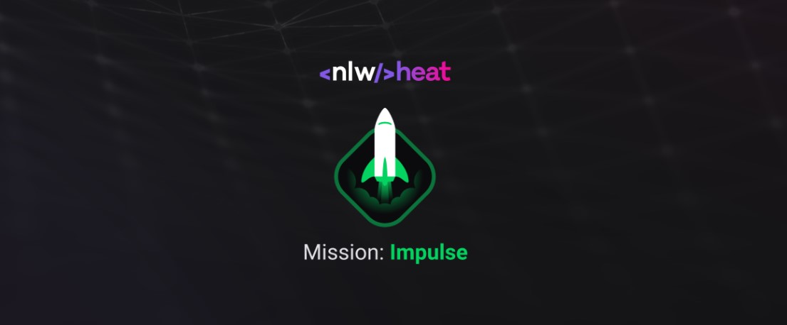
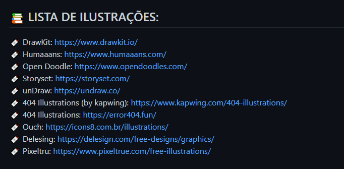

# Next Level Week #7: Heat

Evento da Rocketseat - 18 a 24 de outubro de 2021

## Trilha Impulse

[Layout do Projeto](https://www.figma.com/community/file/1031699316177416916)

[Material Complementar](https://efficient-sloth-d85.notion.site/Impulse-240cb588fb8d4089917c7a6cef0008b3)

[Videos](https://nextlevelweek.com/episodios/impulse/aula-1/edicao/7)

- ✅ 17/out/21 - Abertura
- ✅ 18/out/21 - Stage 1
- ✅ 19/out/21 - Stage 2
- ✅ 20/out/21 - Stage 3
- ✅ 21/out/21 - Stage 4
- ✅ 22/out/21 - Stage 5
- ✅ 24/out/21 - Encerramento

[Repositório da Aula 01 - Node.js](https://github.com/rocketseat-education/nlw-heat-node)\
[Repositório da Aula 02 - ReactJS](https://github.com/rocketseat-education/nlw-heat-web)\
[Repositório da Aula 03 - React Native](https://github.com/rocketseat-education/nlw-heat-reactnative)
[Repositório da Aula 04 - Elixir](https://github.com/rocketseat-education/nlw-heat-elixir)

## Tools

[unDraw](https://undraw.co/)

